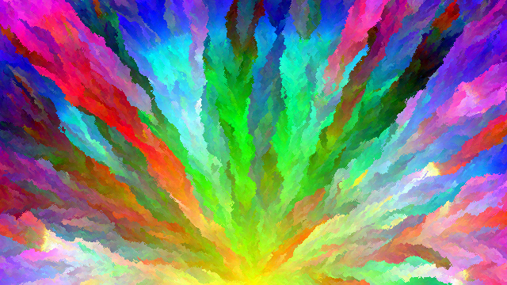
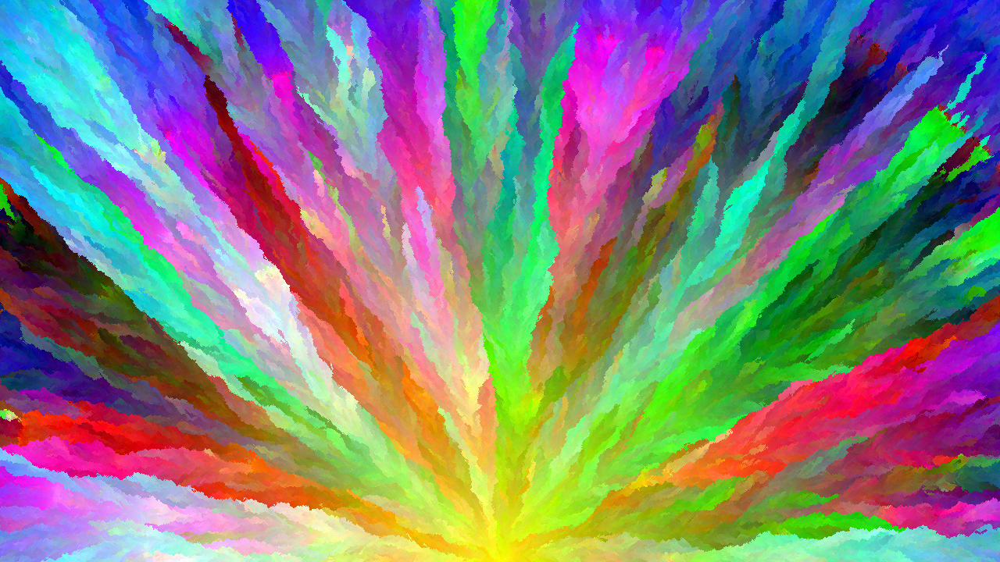

# Colorburst

A desktop Java app that generates bursts of color. Each pixel in the rendered images has a unique color value; no color
appears more than once in the entire image. Colorburst uses 24-bit color (8 bits per channel of red, green, and blue);
as a result, Colorburst is limited to images of 16,777,216 pixels or less. Typical resolutions of 1920x1080, 2560x1440,
3840x2160, and variants, are well within this limit.

Larger images look better than smaller ones because of the increased number of available colors; this 640x360 image
looks much worse than a 1280x720 one with the same seed color and location.

**640x480**

**1280x720**

Note that the two images do not look very similar; in particular, the lower resolution image looks grainier.
Colorburst randomly selects which pixels to work on, so no two images are alike even with the same settings.

## Requirements

Colorburst is built on Java, and requires Java 8 or higher to be installed. A runnable JAR can be downloaded from the
releases page, or you can run and build

## Building and Running

Building Colorburst requires JDK 8 or higher to be installed. 

| Task | Command |
|---|---|
| Run | `./gradlew run` |
| Build a runnable JAR | `./gradlew jar` |

# Time requirements

Colorburst renders images at about 225,000 pixels per minute on an i7-7700k. Your times will vary depending on your CPU
and background CPU usage.
